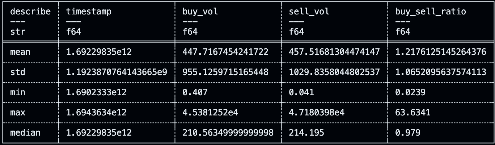
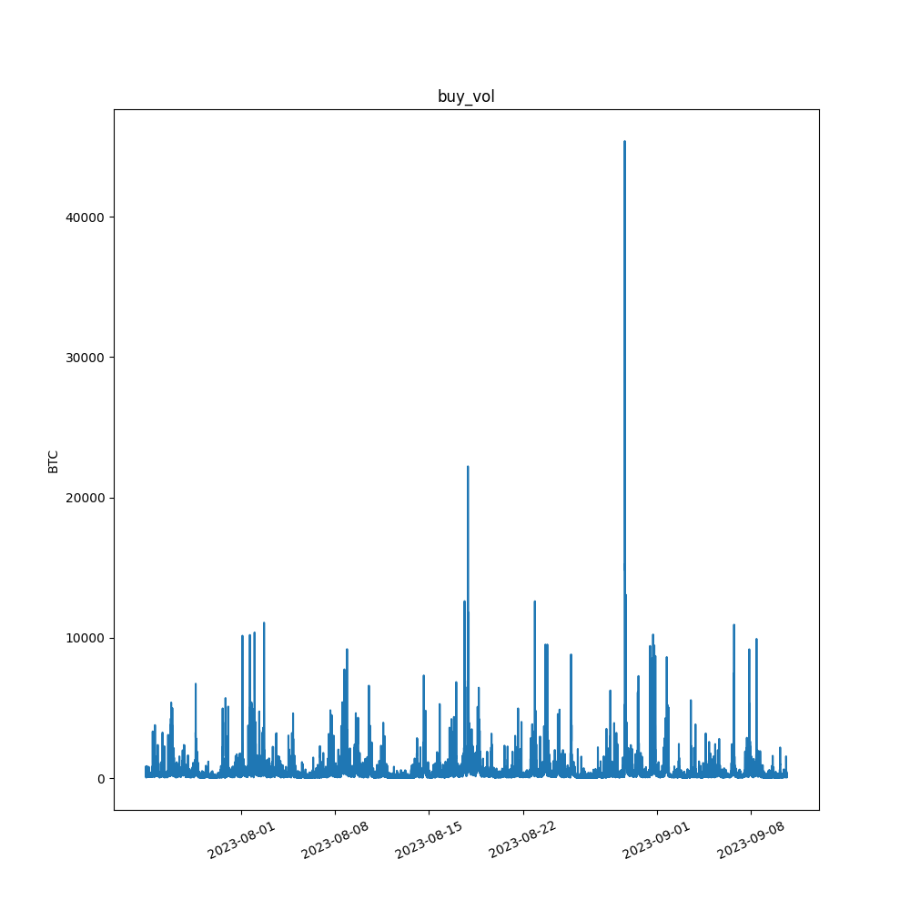
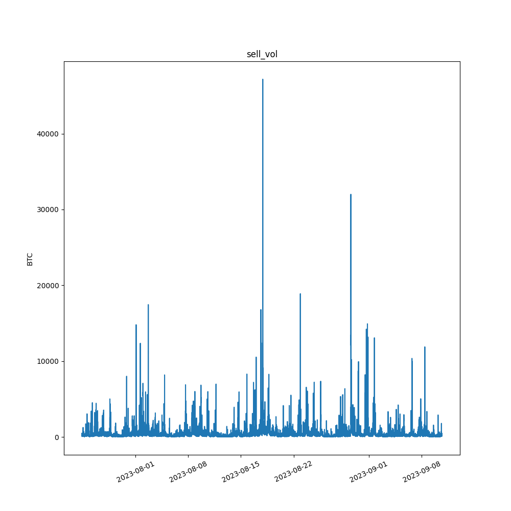
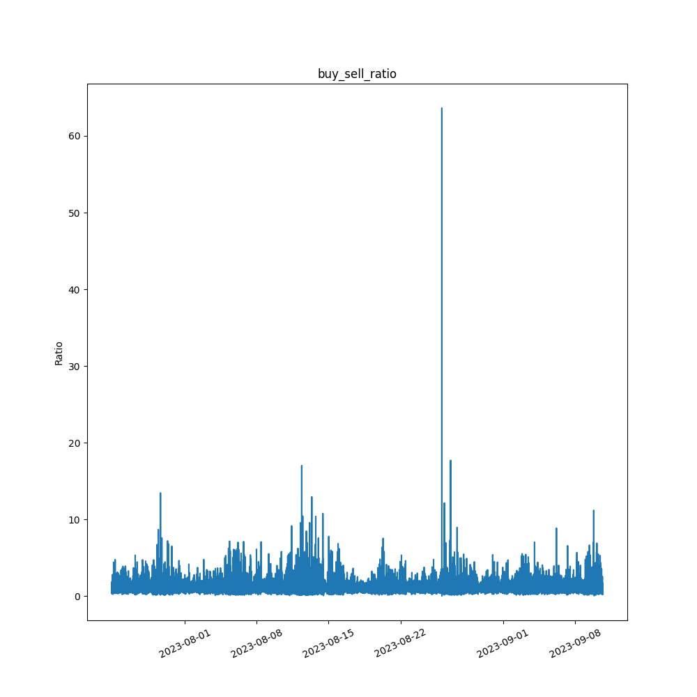

# Python Template 
# Week 3 Mini Project 3 - Polars Descriptive Statistics Script

## Goal
Modify and introduce Polors-based descriptive statistics.

## Overview
We load a csv file from kaggle dataset which is about bitcoin transactions. This project demonstrates some basic statistical info and generates a visualization for data distribution with python libraries like polors,numpy and matplotlib.

Donwload dataset from: https://www.kaggle.com/datasets/jesusgraterol/bitcoin-taker-buysell-volume-binance-futures

My Work:
1) Add the required package in requirements.txt.  **polors 0.10.26** && **matplotlib 3.4.3** && **datetime 5.2** 

2) Add function "loadDf" in main.py which reads a csv file to a pl.dataframe && "describeData" which loads a dataframe and return a statistical info of that data && "plot" that plots a fig shows the relation between x and y

4) Add 3 test functions in test_main.py to test the correctness of the function in main.py

## Requirements
* Python (Version 3.6 or newer)
* Polors (Version 0.10.26)
* Matplotlib (Version 3.4.3)
* Datetime(Version 5.2)

## Output

* Descriptive Statiscs:
  

* Buy Vol Plot
  

* Sell Vol Plot
  
  
* Buy Sell Ratio Plot
  
  
